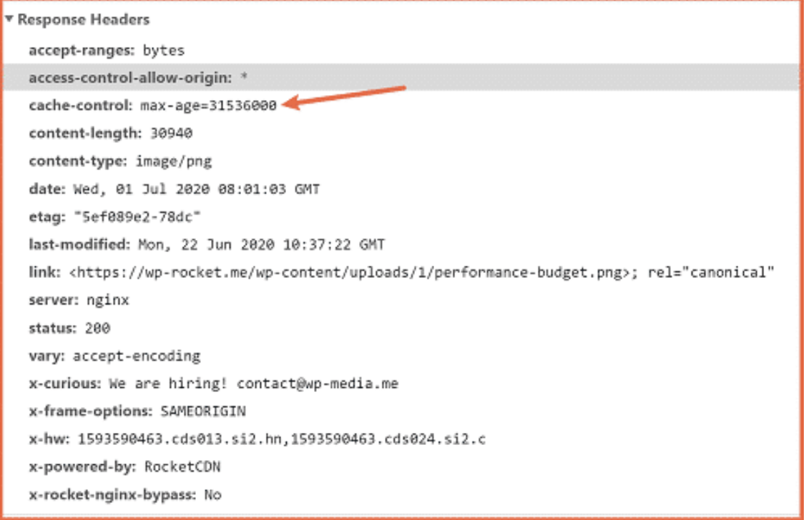

# Welcome To Journey Of BackEnd Engineering

# Hypertext Transfer Protocol (HTTP):

 .
 
 

HTTP stands for Hypertext Transfer Protocol, and it is the foundation of data communication on the World Wide Web (WWW). It is an application layer protocol used for transmitting and receiving data on the internet (Request - Response). HTTP is the protocol that enables web browsers to request and display web pages and allows users to navigate and interact with websites.

 
     Local Host using http://
 
 

## Some key points :

- **Client-Server Model :**
HTTP operates in a client-server model. The client (usually a web browser) sends requests to a server (a web server) for specific resources, such as web pages, images, or other data. The server then processes the request and sends a response back to the client.

- **Stateless Protocol :**
HTTP is considered a stateless protocol, which means each request-response cycle is independent of previous ones. In other words, the server doesn't inherently retain information about previous requests from the same client. To maintain state between requests, web applications often use techniques like cookies or sessions.

- **Text-Based :**
HTTP messages are typically text-based, making them human-readable. An HTTP request consists of a request line, headers, and an optional message body. The response includes a status line, headers, and a response body (such as an HTML page).

- **Connection-Oriented :**
HTTP can be either connection-oriented or connectionless. HTTP/1.0 used a connectionless model, where a new connection was established for each request-response cycle. HTTP/1.1 introduced a connection-oriented model with features like persistent connections, which allow multiple requests and responses to be sent over a single connection, reducing latency.

- **State Management :**
HTTP itself doesn't provide built-in mechanisms for managing session state or authentication. Web developers often rely on cookies and HTTP headers (e.g., Authorization header) to handle these aspects.

- **Secure Version :**
HTTPS (HTTP Secure) is a secure version of HTTP that uses encryption to protect data transmission between the client and the server. It is widely used for secure communication on the web, especially when sensitive information like login credentials or payment details are involved.

- **Methods :**
HTTP defines various request methods, such as GET (retrieve data), POST (send data to be processed), PUT (update data), DELETE (remove data), and others. These methods determine the action to be performed on the resource identified in the URL.

## HTTP Anatomy :
 
 
 
HTTP (Hypertext Transfer Protocol) messages, both requests and responses, have a specific structure or "anatomy." They consist of several components, including headers and an optional message body.

### Types Of Http Headers :
 - Request Header
 - Response Header

***Http has two portion Header section & Body section,where Header section has meta data nad Body as the json or a text anything a server can send into tath body, who every handle that thing***

### What is a Header ?? :
In the context of computer science and networking, a "header" refers to a block of information that precedes or follows a data block and provides metadata or control information about the data it accompanies. Headers are commonly used in various protocols and file formats to convey important details about the associated data. Here are a few common uses of headers:

- **HTTP Headers :**

In the **Hypertext Transfer Protocol (HTTP)**, headers are used to transmit metadata about an HTTP request or response. They provide information such as the content type, content length, caching directives, authentication details, and more. HTTP headers are crucial for the proper functioning of web communication between clients (e.g., web browsers) and servers (e.g., web servers).

- **Email Headers :**

In email communication, **email headers** contain information about the sender, recipient, subject, date, and routing details of an email message. These headers help email clients and servers process and display emails correctly.

- **Network Headers :**

In networking, data packets typically include a header that contains information like source and destination addresses, routing information, and protocol-specific data. For example, in the **IP (Internet Protocol)** header, you'll find IP addresses, time-to-live (TTL), and more.

- **File Format Headers :**

Many file formats, such as image files (e.g., JPEG), audio files (e.g., MP3), and document files (e.g., PDF), have headers that store metadata about the file, including details about its content, dimensions, encoding, and more.

- **Compression Headers :**

In compressed files, headers provide information needed for decompression, such as the compression algorithm used and additional parameters.

- **Protocol Headers :**

Various network protocols, such as TCP, UDP, and DNS, use headers to convey control information relevant to the specific protocol. For example, TCP headers include details about sequence numbers, acknowledgment numbers, and flags.

**Note: Headers are essential for the proper interpretation and processing of data in different contexts. They help systems understand how to handle, route, and display data, making communication and data exchange more reliable and efficient. The format and content of headers vary depending on the specific protocol or file format in use.**

### Does Request and Response header same or different ?? :
Request headers and response headers in HTTP messages are different. They serve distinct purposes and contain information relevant to the particular side of the communication

### But some headers are same irrespective type (Request,Response) header is different ?? :
Some headers that can appear in both request and response messages, but they may serve slightly different purposes or convey related information in the context of the client's request and the server's response

## Depth down in Headers :

A response header example Image
 

### Request Headers

- **Accept**: Informs the server about the media types the client can process in the response.
- **Accept-Charset**: Specifies the character sets the client can understand.
- **Accept-Encoding**: Lists the compression algorithms supported by the client.
- **Accept-Language**: Indicates the preferred languages for the response.
- **Authorization**: Contains credentials for authenticating the client with the server.
- **Cache-Control**: Provides directives for controlling caching behavior.
- **Connection**: Specifies whether the client wants to keep the connection open or close it after the request.
- **Content-Length**: Indicates the size of the request body in octets (bytes).
- **Content-Type**: Specifies the media type of the request body.
- **Cookie**: Contains information about previously set cookies.
- **Host**: Specifies the domain name of the server the client is attempting to connect to.
- **Origin**: Indicates the origin (protocol, domain, and port) of a resource.
- **Referer (or Referer)**: Contains the URL of the referring page.
- **User-Agent**: Identifies the user agent (usually a web browser) making the request.

### Response Headers 

- **Access-Control-Allow-Origin**: Specifies which origins are permitted to access a resource.
- **Age**: Indicates the time in seconds since the response was generated by the server.
- **Cache-Control**: Provides directives for controlling caching behavior in the response.
- **Content-Disposition**: Suggests a filename for the browser to prompt the user to download a file.
- **Content-Encoding**: Specifies the encoding applied to the response body.
- **Content-Length**: Indicates the size of the response body in octets (bytes).
- **Content-Type**: Specifies the media type of the response body.
- **Date**: Indicates the date and time at which the message was sent.
- **ETag**: Provides a unique identifier for a specific version of a resource.
- **Expires**: Specifies the date and time after which the response should be considered stale.
- **Last-Modified**: Indicates the date and time when the resource was last modified.
- **Location**: Used in redirection responses to indicate the new URL.
- **Server**: Provides information about the software and version running on the server.
- **Set-Cookie**: Informs the client about a cookie to be stored.
- **WWW-Authenticate**: Informs the client which authentication method is required.
- **X-Content-Type-Options**: Specifies whether to follow MIME type sniffing.
- **X-Frame-Options**: Helps prevent clickjacking attacks by specifying whether a web page can be displayed in a frame or iframe.
- **X-Powered-By**: Indicates the technology or framework used to build the web server.
- **X-XSS-Protection**: A security header that enables or disables browser-based XSS (cross-site scripting) protection.

### Does HTTP vary with verb/Method which use them ??
HTTP headers can indeed vary depending on the HTTP method (also referred to as HTTP verbs) being used. Different HTTP methods have different purposes and may require specific headers to convey additional information or instructions to the server or client

***But How get are used may changes , even though header may have same name header type like other , how it perform for that http method/verb maybe different***
Common Response Headers:
These response headers are typically present regardless of the HTTP method used:

Content-Type: Specifies the media type of the response body.
Content-Length: Indicates the size of the response body in octets (bytes).
Date: Indicates the date and time at which the response was generated.
Cache-Control: Provides directives for controlling caching behavior in the response.
Server: Provides information about the software and version running on the server.
Method-Specific Response Headers:
Certain HTTP methods may trigger additional or specific response headers:

GET Method: A GET request typically receives headers like Last-Modified (indicating when the resource was last modified) and ETag (providing a unique identifier for the resource).

POST Method: A POST request might receive headers such as Location (if the request results in resource creation and a new resource is created) and Set-Cookie (for setting cookies in the response).

DELETE Method: A DELETE request generally receives headers like Date and Cache-Control.

The specific headers included in a response depend on both the HTTP method used and the server's implementation. The HTTP specification defines the behavior of these headers, and their presence or absence can vary based on how a server handles each method.

In summary, while some response headers are common across all HTTP methods, others may be method-specific or dependent on the server's behavior. It's essential to consult the HTTP specification and the documentation of the specific server or API you are working with to understand the headers you can expect in different scenarios.

## HTTP Body in HTTP Requests and Responses

### Content-Type

The `Content-Type` header in the HTTP request or response specifies the media type or format of the data within the body. Common media types include:
- `text/html` for HTML content.
- `application/json` for JSON data.
- `application/xml` for XML data.
- `multipart/form-data` for file uploads, among others.

### Request Body

In HTTP requests (e.g., POST, PUT), the body contains data that the client sends to the server. For instance, in a POST request to submit a form, the form data is typically included in the request body.

### Response Body

In HTTP responses, the body contains the data that the server sends back to the client. This data can be HTML, JSON, images, files, or any other content relevant to the response.

### Content-Length

The `Content-Length` header indicates the size of the HTTP body in octets (8-bit bytes). It helps the recipient know how much data to expect.

### Content-Encoding

The `Content-Encoding` header specifies the encoding applied to the content within the body. Common encodings include `gzip` and `deflate` for compression.

### Chunked Transfer Encoding

Some responses may use chunked transfer encoding instead of specifying `Content-Length`. In this method, the body is divided into chunks, and each chunk is sent with its size indicator.

### Binary and Text Data

The HTTP body can contain binary data (e.g., images, files) or text data (e.g., HTML, JSON, XML). The content type and encoding information help the client interpret the data correctly.

### Empty Bodies

Not all HTTP requests or responses have a body. For example, a GET request typically doesn't have a request body, and a response to a HEAD request often has an empty body.

In summary, the HTTP body is where the actual content or data is transmitted between the client and server. The format and content of the body are determined by the specific use case, HTTP method, and content type specified in the headers. Understanding the structure of the HTTP body is essential when working with APIs and web services, as it defines how data is exchanged between clients and servers.
You can copy and paste this Markdown code into a .md file for documentation or reference 

## The Journey of an HTTP Request to the Backend

# Request - Response

# Object - Mapper (Jackson)
